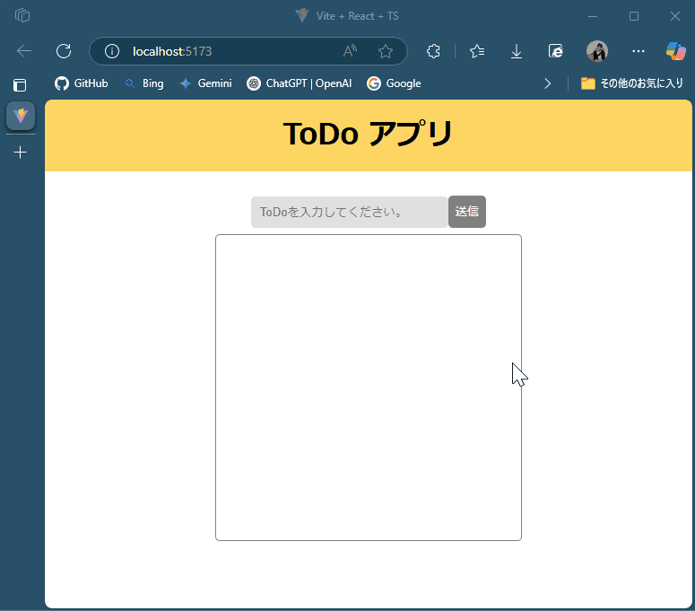
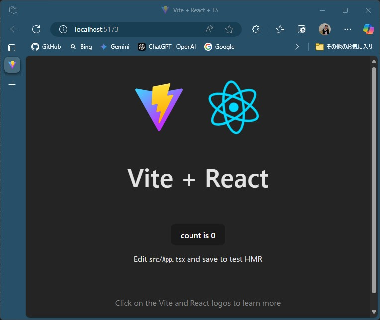
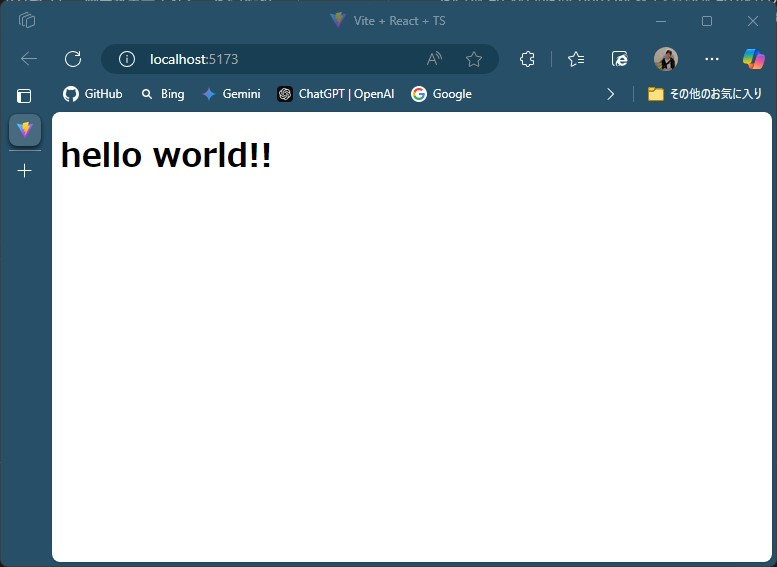

# React による ToDo アプリ開発

React の開発環境の構築から、ToDo アプリの開発を行います。

### 成果物



【機能の内容】

- ToDo 内容を記載し送信ボタンを押す。
- 記入した ToDo をリストに追加して画面に出力する。
- リストは削除ボタンを押すことで削除出来る。

## 開発環境の構築

開発は VScode を利用して開発を実施します。  
[VScode](https://code.visualstudio.com/)

### Node.js のインストール

#### nvm のインストール

まずは、nvm(Node Version Manager)をインストールします。  
nvm を使うと、複数バージョンを切り替えられるから便利。  
Node.js は バージョンによって動かないライブラリがある ことがよくある。  
でも nvm を使えば、プロジェクトごとに最適なバージョンを切り替えられる！

```bash
curl -fsSL https://raw.githubusercontent.com/nvm-sh/nvm/v0.39.4/install.sh | bash
```

インストール後、ターミナルを再起動するか以下のコマンドを実行：

```bash
export NVM_DIR="$HOME/.nvm"
[ -s "$NVM_DIR/nvm.sh" ] && \. "$NVM_DIR/nvm.sh"
[ -s "$NVM_DIR/bash_completion" ] && \. "$NVM_DIR/bash_completion"
```

nvm の動作確認

```bash
nvm -v
```

### Node.js を nvm で管理する

Node.js をインストールする。

```bash
nvm install --lts
nvm use --lts
nvm alias default lts
```

バージョン確認

```bash
node -v
npm -v
```

## Vite プロジェクトの作成

### 初期設定用コマンド

次のコマンドを実行し、React と Vite をダウンロードします。  
※Node.js はインストール済みの想定です。

```bash
npm create vite@latest
```

プロジェクト名を入力します。

```bash
> npx
> create-vite

? Project name: › vite-project
```

framework は React を選択します。

```bash
? Select a framework: › - Use arrow-keys. Return to submit.
❯   Vanilla
    Vue
    React
    Preact
    Lit
    Svelte
    Solid
    Qwik
    Angular
    Others
```

TypeScript を選択します。

```bash
? Select a variant: › - Use arrow-keys. Return to submit.
❯   TypeScript
    TypeScript + SWC
    JavaScript
    JavaScript + SWC
    React Router v7 ↗
```

プロジェクトのフォルダに移動します。

```bash
cd vite-project
```

次のコマンドを実行し必要なパッケージをインストールします。

```bash
npm install
```

次のコマンドを実行し、React の起動確認をします。  
http://loccalhost:5173/ にアクセスし、画面が表示されることを確認します。

```bash
npm run dev
または
npm run dev -- --host
```



### 不要なファイル/処理を削除

デフォルトで作成されている、各種設定や、スクリプトを削除します。  
src フォルダを開き、以下ファイル、スクリプトを削除します。

- assets 配下の react.svg を削除
- App.css を削除
- App.tsx を開き、記載内容を全てクリアして保存
- index.css を開き、記載内容を全てクリアして保存

### App.tsx の追記

なにも記載されていない、App.tsx に以下内容を記載し保存します。  
再度ブラウザで http://loccalhost:5173/ にアクセスし、画面が表示されることを確認します。  
Hello World!!と出力されていれば準備完了です。

```tsx:App.tsx
// App.tsx

const App = () => {
    return (
        <h1>hello world!!</h1>
    )
}

export default App
```



## 開発モジュール

### アプリ構成

アプリは以下の 4 つのコンポーネントで構成されています。

- App.tsx  
  アプリ全体の状態管理およびコンポーネントの結合を行います。

- Nav.tsx  
  アプリのタイトルを表示します。

- Input.tsx  
  ユーザーが ToDo を入力すためのフォームです。

- ToDoList.tsx  
  ToDo を表示します。

### 各種コンポーネント

### App.tsx

```tsx:App.tsx
import Nav from "./components/Nav";
import Input from "./components/Input";
import ToDoList from "./components/ToDoList";
import { useState } from "react";

const App = () => {
  const [todo, setToDo] = useState<string>("");
  const [todoList, setToDoList] = useState<string[]>([]);

  const sendToDo = () => {
    if (todo) {
      setToDoList([...todoList, todo]);
    }
    setToDo("");
  };

  const deleteTodo = (index: number) => {
    const newToDoList = todoList.filter((_, i) => i !== index);
    setToDoList(newToDoList);
  };

  return (
    <div className="App">
      <Nav />
      <Input
        setToDo={setToDo}
        setToDoList={setToDoList}
        sendToDo={sendToDo}
        todo={todo}
      />
      <ToDoList todoList={todoList} deleteTodo={deleteTodo} />
    </div>
  );
};

export default App;
```

### Nav.tsx

```tsx:Nav.tsx
import "./Nav.scss";
const Nav = () => {
  return (
    <div>
      <div className="navbar">
        <h1>ToDo アプリ</h1>
      </div>
    </div>
  );
};

export default Nav;
```

### Input.tsx

```tsx:Input.tsx
import { useState } from "react";
import "./Input.scss";
import "./ToDoList.scss";

type Props = {
  setToDo: React.Dispatch<React.SetStateAction<string>>;
  setToDoList: React.Dispatch<React.SetStateAction<string[]>>;
  sendToDo: () => void;
  todo: string;
};

const Input = (props: Props) => {
  return (
    <div className="input">
      <input
        type="text"
        placeholder="ToDoを入力してください。"
        onChange={(e) => props.setToDo(e.target.value)}
        value={props.todo}
      />
      <button className="sendButton" onClick={() => props.sendToDo()}>
        送信
      </button>
    </div>
  );
};

export default Input;
```

### ToDoList.tsx

```tsx:ToDoList.tsx
import React from "react";

type Props = {
  todoList: string[];
  deleteTodo: (deleteTodo: number) => void;
};

const ToDoList = (props: Props) => {
  return (
    <div className="todoList">
      <ul>
        {props.todoList.map((todo, index) => (
          <li key={index}>
            <p>{todo}</p>
            <button onClick={() => props.deleteTodo(index)}>削除</button>
          </li>
        ))}
      </ul>
    </div>
  );
};

export default ToDoList;
```
